# risk analysis of the assets

## Background

Analysis techniques utilizing Python and Pandas to determine which portfolio performs the best:  

-------

### Prepared the Data

1. Pandas [CSV files](Resources) as a DataFrame and converted the dates to a `DateTimeIndex`.
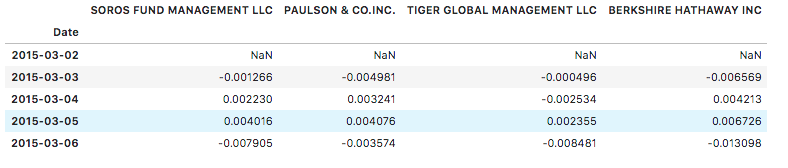

2. Detected and removed null values.

 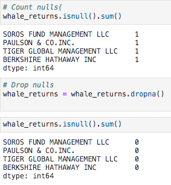

3. Removed dollar signs from the numeric values and converted the data types as needed.

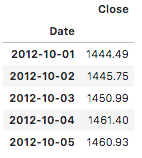

4. Converted the S&P 500 closing prices to daily returns.

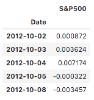

5. concatenated `Whale Returns`, `Algorithmic Returns`, and the `S&P 500 Returns` into a single DataFrame with columns for each portfolio's returns.

  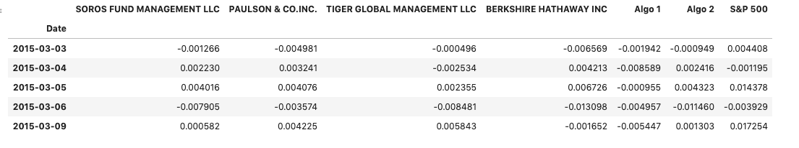
  
### Quantitative Analysis

Analyzed the data to see if any of the portfolios outperform the stock market (i.e., the S&P 500).

#### Performance Analysis

1. Calculated and plotted cumulative returns. checked if any portfolio outperform the S&P 500.

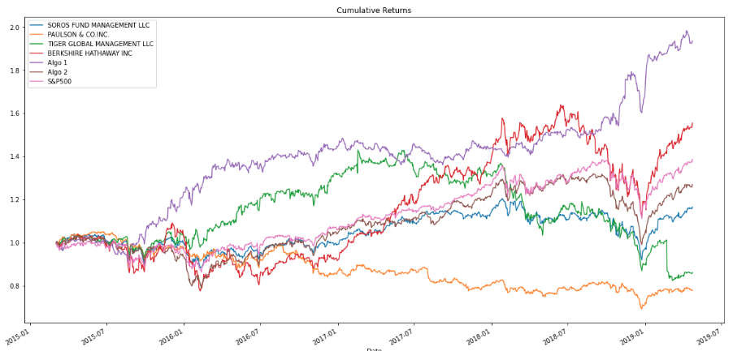

#### Risk Analysis

1. Created a box plot for each of the returns. To determine which box has the largest spread and Which has the smallest spread.

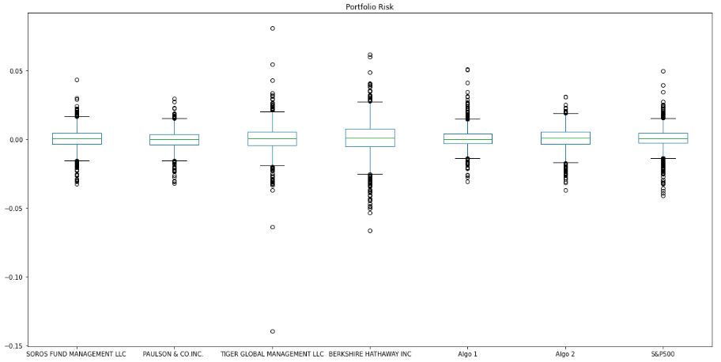

2. Calculated the standard deviation for each portfolio. To determine which portfolios are riskier than the S&P 500.

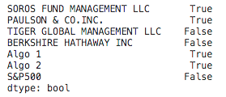

#### Rolling Statistics

1. Plotted the rolling standard deviation of the firm's portfolios along with the rolling standard deviation of the S&P 500. To determine if the risk increases for each of the portfolios at the same time risk increases in the S&P.

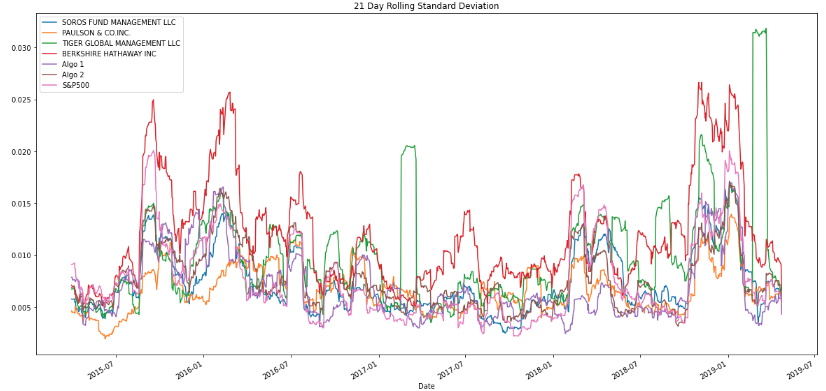

2. Constructed a correlation table for the algorithmic, whale, and S&P 500 returns.To determine Which returns most closely mimic the S&P.

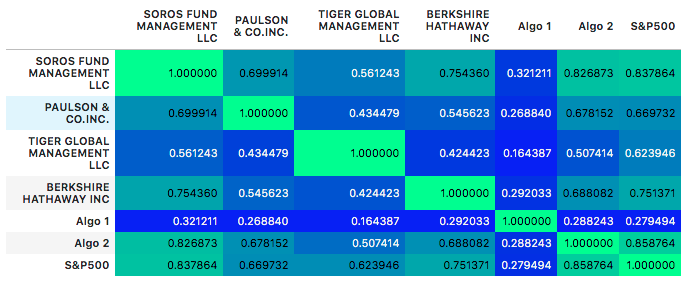

3. Picked *BERKSHIRE HATHAWAY INC* and plotted a rolling beta between that portfolio's returns and S&P 500 returns. To determine if the portfolio is sensitive to movements in the S&P 500.

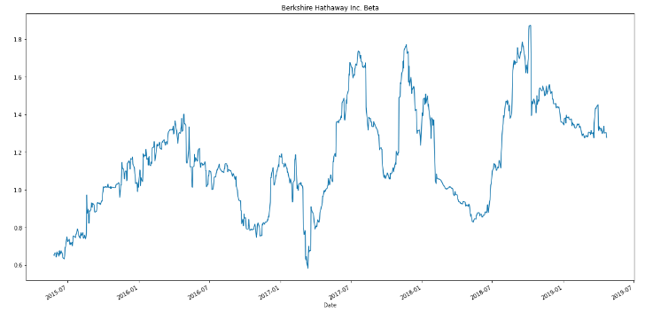

### Plot Sharpe Ratios

Used the daily returns, calculated and visualized the Sharpe ratios using a bar plot.

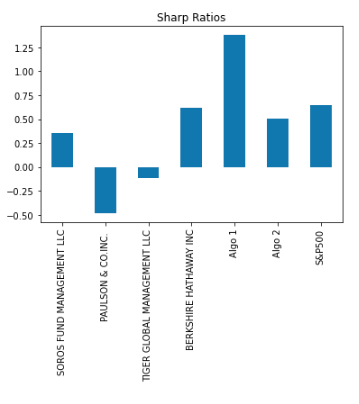
